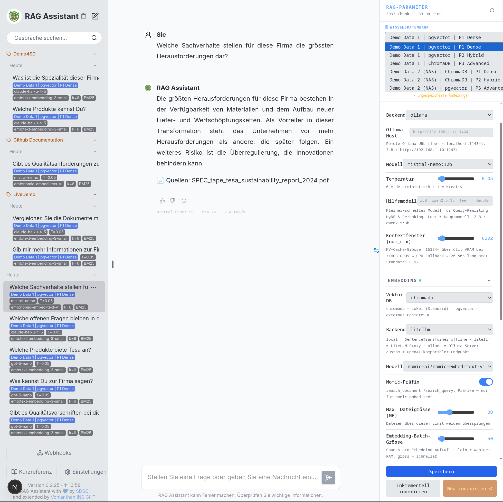

# TRAG — Production-Grade RAG Framework

> A full-stack, production-ready Retrieval-Augmented Generation system.
> Built on the [SDSC SME-KT-ZH Collaboration RAG](https://github.com/SwissDataScienceCenter/sme-kt-zh-collaboration-rag) baseline,
> extended with a complete production stack by [Vonlanthen INSIGHT](https://www.vonlanthen.tv).

---



---

## What is TRAG?

TRAG takes a solid RAG research prototype and turns it into a system you can actually run in production:
multi-knowledge-base management, hybrid retrieval, a full authentication-protected web UI, deployment tooling,
and an OpenAI-compatible API endpoint — all in one repository.

The original SDSC project provides excellent workshop notebooks covering the theory and fundamentals of RAG.
TRAG layers a complete production stack on top, without modifying the upstream notebook material.

---

## Feature Overview

### Baseline (upstream SDSC)

| Area | Description |
|------|-------------|
| Baseline RAG pipeline | Chunk → embed → store → retrieve → generate |
| Document ingestion | PDF, Markdown, XLSX chunkers with configurable strategies |
| Evaluation framework | RAGAS metrics, synthetic dataset generation, ground-truth Q&A |
| Structured outputs | Evidence-level tagging (VERIFIED / CLAIMED / MISSING / MIXED) |
| Advanced retrieval | BM25, hybrid RRF, HyDE, query expansion |
| Agents & tools | LLM tool use, RAG as a tool, multi-step agent workflows |
| Workshop notebooks | Progressive feature tracks (`feature0` – `feature4`) |

### TRAG Extensions (Vonlanthen INSIGHT)

| Area | Feature |
|------|---------|
| **Multi-KB architecture** | Multiple knowledge bases with hot-swap — no restart required |
| **Vector stores** | ChromaDB (local) or pgvector (PostgreSQL) — selectable per KB |
| **Hybrid retrieval** | BM25 + semantic search fused via Reciprocal Rank Fusion (RRF) |
| **Query techniques** | Query expansion, HyDE, LLM reranking — configurable per session |
| **Embedding backends** | `local` (SentenceTransformer, fully offline), `ollama`, `litellm`, `custom` |
| **LLM backends** | Ollama, OpenAI, Anthropic, LiteLLM — switchable at runtime |
| **RAG config panel** | Collapsible right-side panel with presets and live parameter tuning |
| **Session labels** | Label conversations, group by session for A/B evaluation |
| **Config badges** | Per-conversation KB · LLM · T= · emb: · k= · BM25 · Rerank · HyDE display |
| **Generation stats** | Query duration, tokens/second, model name shown per response |
| **Indexing control** | Progress tracking, cancellation, 409 guard against concurrent index |
| **OpenAI-compatible API** | `POST /v1/chat/completions` — works with Open WebUI, curl, any client |
| **Auth** | Password-protected login via session cookie (`API_KEY` in `.env`) |
| **EPUB / DOCX support** | MarkItDown chunker for non-PDF formats |
| **i18n** | DE / EN / FR / IT |
| **Async architecture** | Full `asyncio` + `run_in_executor` — non-blocking, production-safe |
| **Deployment tooling** | Systemd user services, nginx reverse proxy config, `.env` templates |

---

## Architecture

```
┌────────────────────────────────────────────────────────────┐
│                        Next.js Frontend                     │
│   Chat UI · RAG Config Panel · Session Labels · i18n        │
│   Auth (session cookie) · Sidebar badges · Source citations │
└───────────────────────┬────────────────────────────────────┘
                        │ HTTP (proxy rewrite)
┌───────────────────────▼────────────────────────────────────┐
│                     FastAPI Backend                          │
│  /rag · /kb · /v1/chat/completions (OpenAI-compat)          │
│                                                             │
│  ┌──────────────────────────────────────────────────────┐  │
│  │              KB Registry (hot-swap)                   │  │
│  │  KB-A: ChromaDB · local embed · BM25+semantic        │  │
│  │  KB-B: pgvector · LiteLLM embed · semantic only      │  │
│  │  KB-N: ...                                           │  │
│  └──────────────────────────────────────────────────────┘  │
│                                                             │
│  Retrieval pipeline: Query → [BM25 | Semantic | HyDE]       │
│                      → RRF fusion → Reranker → Top-K        │
└──────────┬──────────────────────────┬──────────────────────┘
           │                          │
┌──────────▼──────────┐   ┌──────────▼──────────┐
│   Vector Store       │   │     LLM Backend      │
│  ChromaDB / pgvector │   │ Ollama / OpenAI /    │
│  (per-KB, HNSW ANN)  │   │ Anthropic / LiteLLM  │
└─────────────────────┘   └─────────────────────┘
```

See [ARCHITECTURE.md](ARCHITECTURE.md) for the full technical deep-dive.

---

## Quick Start

### Requirements

- Python ≥ 3.12
- Node.js ≥ 18
- [Ollama](https://ollama.com) (for local LLM inference, optional)

### Backend

```bash
# Create and activate a virtual environment
python -m venv rag_venv
source rag_venv/bin/activate

# Install dependencies
pip install -r requirements.txt

# Start backend (Ollama)
BACKEND=ollama python -m sme_kt_zh_collaboration_rag.main

# Start backend (LiteLLM proxy)
BACKEND=litellm LITELLM_BASE_URL=https://your-litellm/v1 LITELLM_API_KEY=sk-... \
  python -m sme_kt_zh_collaboration_rag.main

# Start backend (OpenAI)
BACKEND=openai OPENAI_API_KEY=sk-... python -m sme_kt_zh_collaboration_rag.main
```

### Frontend

```bash
cd frontend
cp .env.example .env          # edit API_KEY to set your login password
npm install
npm run dev
# → http://localhost:3000
```

### First run — create a Knowledge Base

1. Log in at `http://localhost:3000`
2. Open the **RAG Parameters** panel (right side)
3. Click **+** next to the knowledge base selector
4. Enter a name and the path to your documents (e.g. `data/`)
5. Choose embedding backend (default: local SentenceTransformer — no API key needed)
6. Click **Re-index** — progress shows file and chunk count in real time
7. Start asking questions

---

## Environment Variables

### Backend

| Variable | Required for | Example |
|----------|-------------|---------|
| `BACKEND` | All | `ollama` / `openai` / `litellm` / `anthropic` |
| `OPENAI_API_KEY` | OpenAI LLM or embedding | `sk-...` |
| `ANTHROPIC_API_KEY` | Anthropic LLM | `sk-ant-...` |
| `LITELLM_BASE_URL` | LiteLLM proxy | `https://your-litellm/v1` |
| `LITELLM_API_KEY` | LiteLLM proxy | `sk-...` |
| `ALLOW_ORIGINS` | CORS config | `http://localhost:3000` |

### Frontend (`.env`)

| Variable | Description |
|----------|-------------|
| `API_KEY` | Login password for the web UI |
| `BACKEND_URL` | Backend URL (server-side proxy). Default: `http://localhost:8080` |
| `SERVER_URL` | Override for browser-side API calls. Leave empty for same-origin proxy. |

> **Important:** Leave `SERVER_URL` empty unless you have a specific reason to set it.
> Setting it to a hostname causes API calls to route externally, which breaks same-network setups.

---

## Deployment (systemd + nginx)

For production deployment on a Linux server:

```bash
# Copy service templates and adjust paths
cp insight-backend.service ~/.config/systemd/user/
cp insight-frontend.service ~/.config/systemd/user/

systemctl --user daemon-reload
systemctl --user enable --now insight-backend insight-frontend

# Check status
systemctl --user status insight-backend insight-frontend
```

A sample nginx reverse proxy configuration is included in `nginx.conf`.

---

## Workshop Notebooks

The workshop notebooks from the upstream SDSC project are included in `backend/notebooks/`.
They cover the full RAG theory from basics to agents:

| Notebook | Topic |
|----------|-------|
| `feature0a_baseline_rag.ipynb` | Baseline RAG pipeline |
| `feature0b_ingestion.ipynb` | Document ingestion & chunking |
| `feature1a_evaluation.ipynb` | Evaluation with RAGAS |
| `feature1b_dataset_creation.ipynb` | Synthetic dataset generation |
| `feature2a_structured_outputs.ipynb` | Structured evidence outputs |
| `feature3a_advanced_retrieval.ipynb` | BM25, hybrid RRF, metadata filtering |
| `feature3b_conversation.ipynb` | Conversational RAG |
| `feature3c_query_techniques.ipynb` | Query expansion, HyDE |
| `feature3d_context_enrichment.ipynb` | Context enrichment, token budgets |
| `feature4a–4e` | Tools, agents, RAG as a tool |

```bash
jupyter lab
# Open backend/notebooks/feature0a_baseline_rag.ipynb to start
```

---

## Repository Structure

```
.
├── backend/
│   ├── notebooks/                    # Workshop notebooks (feature0a – feature4e)
│   └── src/sme_kt_zh_collaboration_rag/
│       ├── main.py                   # FastAPI entry point
│       ├── kb_router.py              # KB registry, hot-swap, indexing control [TRAG]
│       ├── rag_router.py             # RAG query endpoints [TRAG]
│       ├── openai_compat_router.py   # /v1/chat/completions endpoint [TRAG]
│       └── feature0_baseline_rag.py  # Baseline RAG pipeline
│
├── conversational-toolkit/
│   └── src/conversational_toolkit/
│       ├── agents/                   # RAG agent (retrieval + generation)
│       ├── api/                      # FastAPI server and routes
│       ├── chunking/                 # PDF, EPUB, DOCX, Markdown chunkers [TRAG]
│       ├── embeddings/               # SentenceTransformer, Ollama, LiteLLM [TRAG]
│       ├── llms/                     # OpenAI, Ollama, Anthropic, LiteLLM
│       ├── retriever/                # BM25, semantic, hybrid retriever [TRAG]
│       └── vectorstores/             # ChromaDB, pgvector [TRAG]
│
├── frontend/
│   └── src/
│       ├── components/
│       │   ├── sections/
│       │   │   ├── rag-config-panel.tsx  # RAG Parameters panel [TRAG]
│       │   │   ├── sidebar/              # History, session labels, badges [TRAG]
│       │   │   └── send-bar.tsx
│       │   └── ui/
│       └── pages/
│           ├── login.tsx                 # Auth page [TRAG]
│           └── api/auth/                 # Login / logout handlers [TRAG]
│
├── data/                             # Document corpus (see below)
├── docs/screenshots/                 # UI screenshots
├── ARCHITECTURE.md                   # Technical deep-dive [TRAG]
├── CHANGELOG.md                      # Version history [TRAG]
├── CONTRIBUTORS.md                   # Contributor list
├── nginx.conf                        # Reverse proxy config [TRAG]
├── insight-backend.service           # Systemd backend service [TRAG]
└── insight-frontend.service          # Systemd frontend service [TRAG]
```

Items marked `[TRAG]` are additions by Vonlanthen INSIGHT.

---

## Dataset (PrimePack AG Scenario)

The demo dataset models **PrimePack AG**, a packaging company evaluating supplier sustainability claims.
Documents are organized by prefix:

| Prefix | Meaning |
|--------|---------|
| `ART_` | Artificial scenario documents (with deliberate flaws for RAG stress-testing) |
| `EPD_` | Third-party verified Environmental Product Declarations |
| `SPEC_` | Product specifications and datasheets |
| `REF_` | Regulatory and reference documents (GHG Protocol, CSRD, ISO 14024) |
| `EVALUATION_` | Ground-truth Q&A for evaluation (not indexed in the RAG corpus) |

Key design features of the dataset:
- **Evidence quality varies deliberately** — from verified EPDs to missing data
- **Conflicts are intentional** — old vs. new datasheet with different GWP figures
- **Gaps are part of the answer** — the correct response to missing data is "we don't know"

---

## Contributing

Contributions are welcome — new retrieval strategies, additional chunkers, frontend improvements, or bug fixes.

```bash
git checkout -b feature/my-feature
# ... make changes ...
git push origin feature/my-feature
# Open a pull request
```

Please read the upstream [Contributing guide](https://github.com/SwissDataScienceCenter/sme-kt-zh-collaboration-rag#contributing)
for general conventions. TRAG-specific additions should be marked with `[TRAG]` in inline comments.

---

## License

Apache License 2.0 — see [LICENSE](LICENSE).

**Copyright 2026 Swiss Data Science Center (SDSC), ETH Zürich / EPFL**
**Copyright 2026 Vonlanthen INSIGHT (https://www.vonlanthen.tv)**

This project is a fork of the [SDSC SME-KT-ZH Collaboration RAG](https://github.com/SwissDataScienceCenter/sme-kt-zh-collaboration-rag).
Any further fork or derivative work must retain both copyright notices as required by the Apache License 2.0.

---

## Upstream

Original project: [SwissDataScienceCenter/sme-kt-zh-collaboration-rag](https://github.com/SwissDataScienceCenter/sme-kt-zh-collaboration-rag)
Authors: Swiss Data Science Center (SDSC), ETH Zürich / EPFL

TRAG fork: [voninsight/TRAG](https://github.com/voninsight/TRAG)
Maintained by: [Vonlanthen INSIGHT](https://www.vonlanthen.tv)
